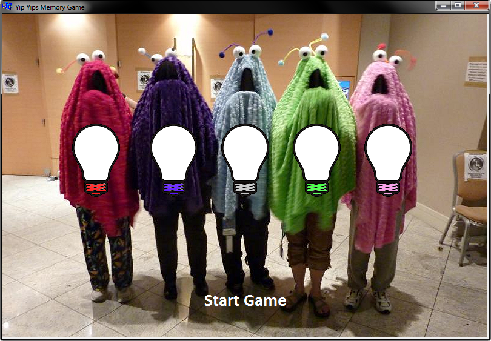
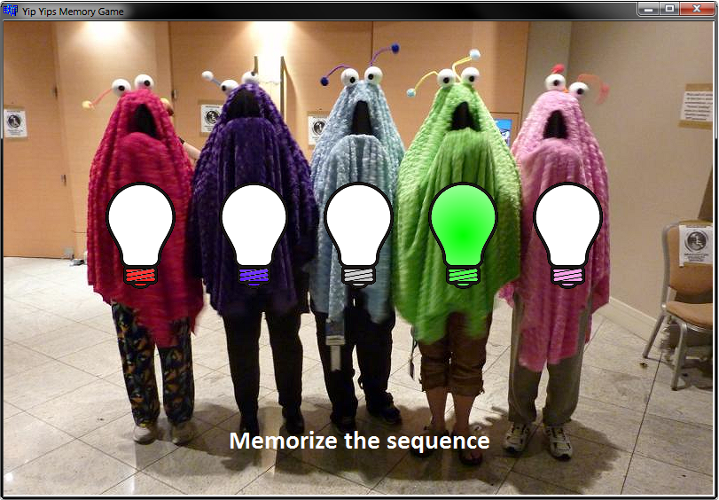

# Learning Object C++ - Windows Builder Yip Yips Memory Game
> Training course - Pasja Informatyki, Object C++ course, episode 11 ( [Link](https://www.youtube.com/watch?v=3_rYtfWPrZ4) )

## General info
Windows GUI game written in C++ Builder 6.0. It's a simple Memory Game with sound and pictures. Player has to memorize the sequence, and then play it back in the correct order.

## Technologies
* C++
* C++ Builder 6.0 (IDE)

## Screenshots

## Contact
[ReznoRMichael](https://github.com/ReznoRMichael)